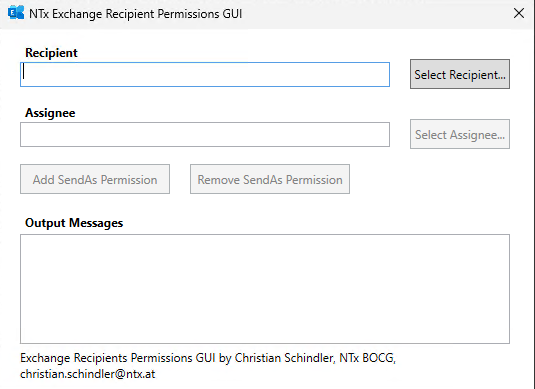

Recipients Permission GIU
========================
### What is it?
A PowerShell GUI that allows adding/removing "Send-As" permissions for any combination of user/group (user/group, user/user, group/user, group/group).

While this it theoretically possible in the Exchange Admin Center, a bug in the logic of EAC prevents you from assigning "Send-As" permissions to groups, etc.

### Prerequisites
1. To be able to use the GUI you first need to implement the permission change in AD as described in this KB-Article:
https://support.microsoft.com/en-us/topic/access-denied-when-you-try-to-give-user-send-as-or-receive-as-permission-for-a-distribution-group-in-exchange-server-505822f4-8dca-7b97-d378-c8416553f6d2

2. The script must be run on a machine where Exchange Management Tools are installed.

### How to use it
Download the code (not only the script) and extract it to a folder of your choice.

First, get rid of the alternate file stream which is added by browsers for downloads from the internet.
Open a PowerShell Window and change to the directory where you extracted the code. Then use the following command:

```powershell
    gci -recurse | Unblock-File
```

After you unblocked all those files, simply run the script an it will open GUI:

```powershell
    .\RecipientPermissionsGUI.ps1
```

A logfile will be created in a subfolder "Logs" everytime you start the script.

The script uses the exchange management shell to automatically connect to an exchange server in your environment.



**Recipient**: the recipient object where the permissions should be added/removed. Can be a user or a group. Please use the "Select Recipient..." button to select the correct recipient. After you selected a valid recipient. The "Select Assignee..." button will be enabled.

**Assignee**: the recipient object where the permissions should granted to. Can be a user or a group. Please use the "Select Assignee..." button to select the correct recipient. After you selected a valid assigne. The "Add SendAs Permissions" and "Remove SendAs Permissions" buttons will be enabled.